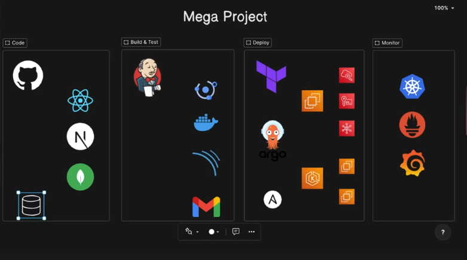
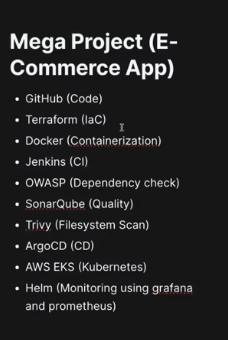
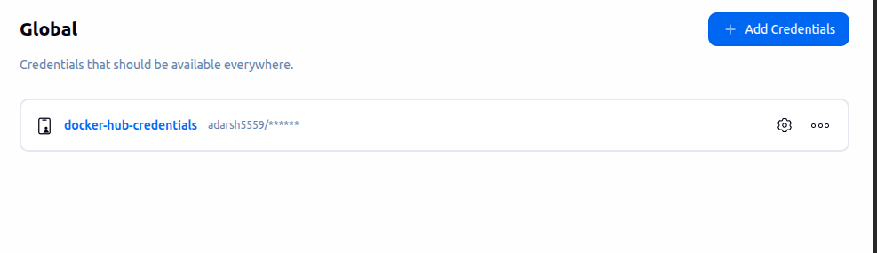
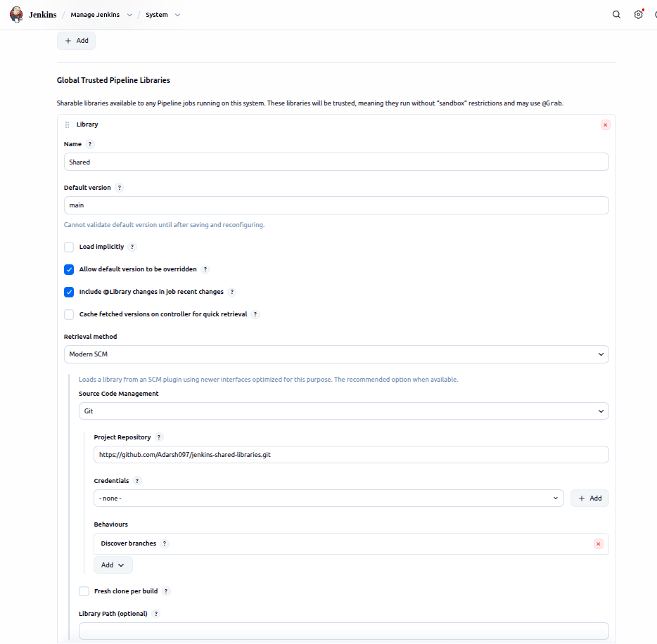

## Ecommerce App Deployment 




# Flow
1. Developer writes code and push it to github repo.
2. Image can be stored in S3/CDN. -> (optimisation)
3. There is db.json that is used to migrate the data in to the database.
4. Can Dockerfile for database can be multi- stage build? -> (optimisation)
5. Can you run the Dockerfile as non-root user? -> (optimisation)
6. Image will be pushed into the Dockerhub.
7. Trivy/dockerscout/sonarqube -> to scan the filesystem. -> (optimisation)
8. In this project, I am doing installation of jenkins/trivy/kubectl using the terraform data-block -> make it using the ansible playbook. -> (optimisation).

 
 ```
1. Setup terraform and aws cli
2. Configure the aws-cli
3. aws s3 ls -> to check if s3 bucket is pre-existing.
4. Create private/public key-pair -> to access the instances.

5. chmod 400 terra-key -> only read permission
6. terraform init
7. terraform plan -compact-warnings
8. tf apply -auto-approve


 ```

9. Infrastructure is setup now.

10. Using "user_data", docker, jenkins, helm, trivy, kubectl are installed.

11. Update your kubeconfig: wherever you want to access your eks wheather it is yur local machine or bastion server this command will help you to interact with your eks.
```
1. aws configure

2. aws eks --region ap-south-1 update-kubeconfig --name ad-eks-cluster

3. kubectl get nodes


```

Your **CloudTrail output clearly shows the real problem**.

Important line in your event:

```
"bootstrapClusterCreatorAdminPermissions": false
```

Because of this setting in Amazon EKS, the **cluster creator does NOT automatically get admin access**.

Normally EKS gives the creator **system:masters** permission, but Terraform created the cluster **without that permission**.

So even though **project-user created the cluster**, Kubernetes RBAC does **not allow access**. That is why kubectl fails.

---

# Correct Fix (Best DevOps Way)

Since the cluster was created with **authenticationMode = API_AND_CONFIG_MAP**, you must **grant access using the EKS Access API**.

Run this command:

```bash
aws eks create-access-entry \
--cluster-name ad-eks-cluster \
--principal-arn arn:aws:iam::520827482778:user/project-user \
--region ap-south-1
```

---

# Then attach admin policy

Run:

```bash
aws eks associate-access-policy \
--cluster-name ad-eks-cluster \
--principal-arn arn:aws:iam::520827482778:user/project-user \
--policy-arn arn:aws:eks::aws:cluster-access-policy/AmazonEKSClusterAdminPolicy \
--access-scope type=cluster \
--region ap-south-1
```

This grants **cluster admin permission**.

---

# Now update kubeconfig again

```bash
aws eks update-kubeconfig --region ap-south-1 --name ad-eks-cluster
```

---

# Test

Now run:

```bash
kubectl get nodes
```

You should see something like:

```
NAME                           STATUS   ROLES    AGE
ip-192-168-xx-xx.ec2.internal  Ready    <none>   10m
```

---

# Why this happened (Important for interviews)

Your Terraform module created the cluster with:

```
bootstrapClusterCreatorAdminPermissions = false
```

This means:

• Creator IAM user **gets zero Kubernetes access**
• Access must be granted via **EKS Access API or aws-auth ConfigMap**

This is **a common mistake in Terraform EKS setups**.

---

# Recommended Terraform fix (for future)

In your Terraform EKS module set:

```hcl
enable_cluster_creator_admin_permissions = true
```

or add:

```hcl
access_entries = {
  project-user = {
    principal_arn = "arn:aws:iam::520827482778:user/project-user"
    policy_associations = {
      admin = {
        policy_arn = "arn:aws:eks::aws:cluster-access-policy/AmazonEKSClusterAdminPolicy"
        access_scope = {
          type = "cluster"
        }
      }
    }
  }
}
```


---


12. Add dockerHub credentials to jenkins credentils global.



13. Add github credentials: username(Adarsh097), password(PAT)


14. Install pluggins -> docker, docker pipeline, pipeline stage view

15. You will be using shared-jenkins-groovy library.

16. Manage Jenkins -> System


17. Confirm this
```
ubuntu@ip-172-31-15-48:~$ sudo usermod -aG docker jenkins
ubuntu@ip-172-31-15-48:~$ sudo usermod -aG docker ubuntu
ubuntu@ip-172-31-15-48:~$ newgrp docker
ubuntu@ip-172-31-15-48:~$ docker ps

```

18. Create pipleline using the code in jenkins file.
19. Make the change in the kubernetes manifests as per domain or email.

# Continuous deployment

```


```