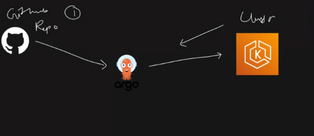
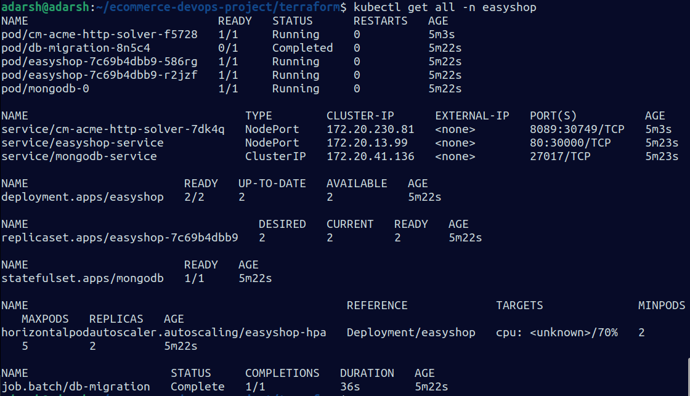
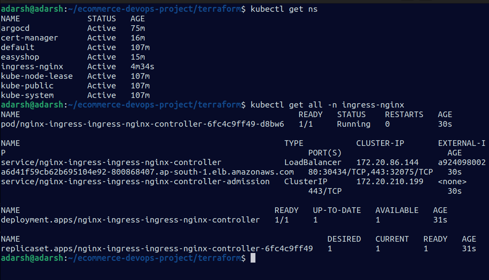

## Ecommerce App Deployment 


# Flow
1. Developer writes code and push it to github repo.
2. Image can be stored in S3/CDN. -> (optimisation)
3. There is db.json that is used to migrate the data in to the database.
4. Can Dockerfile for database can be multi- stage build? -> (optimisation)
5. Can you run the Dockerfile as non-root user? -> (optimisation)
6. Image will be pushed into the Dockerhub.
7. Trivy/dockerscout/sonarqube -> to scan the filesystem. -> (optimisation)
8. In this project, I am doing installation of jenkins/trivy/kubectl using the terraform data-block -> make it using the ansible playbook. -> (optimisation).

 
 ```
1. Setup terraform and aws cli
2. Configure the aws-cli
3. aws s3 ls -> to check if s3 bucket is pre-existing.
4. Create private/public key-pair -> to access the instances.

5. chmod 400 terra-key -> only read permission
6. terraform init
7. terraform plan -compact-warnings
8. tf apply -auto-approve


 ```

9. Infrastructure is setup now.

10. Using "user_data", docker, jenkins, helm, trivy, kubectl are installed.

11. Update your kubeconfig: wherever you want to access your eks wheather it is yur local machine or bastion server this command will help you to interact with your eks.
```
1. aws configure

2. aws eks --region ap-south-1 update-kubeconfig --name ad-eks-cluster

3. kubectl get nodes


```

Your **CloudTrail output clearly shows the real problem**.

Important line in your event:

```
"bootstrapClusterCreatorAdminPermissions": false
```

Because of this setting in Amazon EKS, the **cluster creator does NOT automatically get admin access**.

Normally EKS gives the creator **system:masters** permission, but Terraform created the cluster **without that permission**.

So even though **project-user created the cluster**, Kubernetes RBAC does **not allow access**. That is why kubectl fails.

---

# Correct Fix (Best DevOps Way)

Since the cluster was created with **authenticationMode = API_AND_CONFIG_MAP**, you must **grant access using the EKS Access API**.

Run this command:

```bash
aws eks create-access-entry \
--cluster-name ad-eks-cluster \
--principal-arn arn:aws:iam::520827482778:user/project-user \
--region ap-south-1
```

---

# Then attach admin policy

Run:

```bash
aws eks associate-access-policy \
--cluster-name ad-eks-cluster \
--principal-arn arn:aws:iam::520827482778:user/project-user \
--policy-arn arn:aws:eks::aws:cluster-access-policy/AmazonEKSClusterAdminPolicy \
--access-scope type=cluster \
--region ap-south-1
```

This grants **cluster admin permission**.

---

# Now update kubeconfig again

```bash
aws eks update-kubeconfig --region ap-south-1 --name ad-eks-cluster
```

---

# Test

Now run:

```bash
kubectl get nodes
```

You should see something like:

```
NAME                           STATUS   ROLES    AGE
ip-192-168-xx-xx.ec2.internal  Ready    <none>   10m
```

---

# Why this happened (Important for interviews)

Your Terraform module created the cluster with:

```
bootstrapClusterCreatorAdminPermissions = false
```

This means:

• Creator IAM user **gets zero Kubernetes access**
• Access must be granted via **EKS Access API or aws-auth ConfigMap**

This is **a common mistake in Terraform EKS setups**.

---

# Recommended Terraform fix (for future)

In your Terraform EKS module set:

```hcl
enable_cluster_creator_admin_permissions = true
```

or add:

```hcl
access_entries = {
  project-user = {
    principal_arn = "arn:aws:iam::520827482778:user/project-user"
    policy_associations = {
      admin = {
        policy_arn = "arn:aws:eks::aws:cluster-access-policy/AmazonEKSClusterAdminPolicy"
        access_scope = {
          type = "cluster"
        }
      }
    }
  }
}
```


---


12. Add dockerHub credentials to jenkins credentils global.


13. Add github credentials: username(Adarsh097), password(PAT)


14. Install pluggins -> docker, docker pipeline, pipeline stage view

15. You will be using shared-jenkins-groovy library.

16. Manage Jenkins -> System


17. Confirm this
```
ubuntu@ip-172-31-15-48:~$ sudo usermod -aG docker jenkins
ubuntu@ip-172-31-15-48:~$ sudo usermod -aG docker ubuntu
ubuntu@ip-172-31-15-48:~$ newgrp docker
ubuntu@ip-172-31-15-48:~$ docker ps

```

18. Create pipleline using the code in jenkins file.
19. Make the change in the kubernetes manifests as per domain or email.

# Continuous deployment - ArgoCD

```
aws eks update-kubeconfig --region ap-south-1 --name ad-eks-cluster

kubectl create namespace argocd

kubectl apply -n argocd -f https://raw.githubusercontent.com/argoproj/argo-cd/stable/manifests/install.yaml

kubectl get all -n argocd

# Change argocd-server service from ClusterIP -> NodePort
kubectl patch svc argocd-server -n argocd -p '{"spec": {"type": "NodePort"}}'

kubectl port-forward svc/argocd-server -n argocd <your-port>:443 --address=0.0.0.0 &

# Get argocd password

kubectl -n argocd get secret argocd-initial-admin-secret -o jsonpath="{.data.password}" | base64 -d; echo

```

20. ArgoCD monitors the github repo where kubernetes manifest are kept. As soon as it detects any change, it deploys the latest manifests on the eks cluster.

21. Settings -> Repositories -> connect repo : to connect your github repository

## Adding eks-cluster to argocd
```
sudo curl --silent --location -o /usr/local/bin/argocd https://github.com/argoproj/argo-cd/releases/download/v2.4.7/argocd-linux-amd64

sudo mv argocd /usr/local/bin/

sudo chmod +x /usr/local/bin/argocd

argocd version

```

# Login to argocd via cli

```
argocd login 13.201.73.142:31629 --username admin

WARNING: server certificate had error: error creating connection: tls: failed to verify certificate: x509: cannot validate certificate for 13.201.73.142 because it doesn't contain any IP SANs. Proceed insecurely (y/n)? y

Password: 
'admin:login' logged in successfully
Context '13.201.73.142:31629' updated

```

22. argocd cluster list -> to see the clusters configured on argocd.

23. Get the current cluster context
```
kubectl config current-context
arn:aws:eks:ap-south-1:520827482778:cluster/ad-eks-cluster

```

24. Add cluster to argocd
```
argocd cluster add arn:aws:eks:ap-south-1:520827482778:cluster/ad-eks-cluster --name ad-eks-cluster
```

25. Create a new application -> lowercase

Here it is **exactly in clean formatted steps (as-is)** 👇

---

# 🚀 Deploy Your Application in Argo CD GUI

On the Argo CD homepage, click on the **“New App”** button.

---

## Fill in the following details:

### 🔹 General Section

* **Application Name:** Enter your desired app name
* **Project Name:** Select `default` from the dropdown
* **Sync Policy:** Choose `Automatic`

---

### 🔹 Source Section

* **Repo URL:** Add the Git repository URL that contains your Kubernetes manifests
* **Path:** `kubernetes` *(or the actual path inside the repo where your manifests reside)*

---

### 🔹 Destination Section

* **Cluster URL:** `https://kubernetes.default.svc` *(usually shown as "default")*
* **Namespace:** `tws-e-commerce-app` *(or your desired namespace)*

---

## ✅ Final Step

Click on **“Create”**

---

That’s it 👍


26. Install cert-manager on cluster

```
kubectl apply -f https://github.com/cert-manager/cert-manager/releases/download/v1.13.1/cert-manager.yaml

```



27. You can access the website at: NodeIP:port.

## To access the website using domain name.

---

# Nginx Ingress Controller

## Install the Nginx Ingress Controller using Helm

### Step 1: Create Namespace

```bash
kubectl create namespace ingress-nginx
```

---

### Step 2: Add Helm Repository

```bash
sudo snap install helm --classic

helm repo add ingress-nginx https://kubernetes.github.io/ingress-nginx
```

```bash
helm repo update
```

---

### Step 3: Install Nginx Ingress Controller

```bash
helm install nginx-ingress ingress-nginx/ingress-nginx \
  --namespace ingress-nginx \
  --set controller.service.type=LoadBalancer
```

---

### Step 4: Check Pod Status

```bash
kubectl get pods -n ingress-nginx
```

---

### Step 5: Get External IP of LoadBalancer

```bash
kubectl get svc -n ingress-nginx
```

---



## Go to GoDaddy and a new DNS Record

1. Go and access the website using easyshop.adtechs.xyz


## Monitoring

Here it is **cleanly formatted (as-is, structured properly)** 👇

---

# Monitor EKS Cluster using Prometheus & Grafana via Helm

## Install Helm (On Master Machine)

```bash
curl -fsSL -o get_helm.sh https://raw.githubusercontent.com/helm/helm/main/scripts/get-helm-3
```

```bash
chmod 700 get_helm.sh
```

```bash
./get_helm.sh
```

---

## Add Helm Stable Charts for Your Local Client

```bash
helm repo add stable https://charts.helm.sh/stable
```

---

## Add Prometheus Helm Repository

```bash
helm repo add prometheus-community https://prometheus-community.github.io/helm-charts
```

---

## Create Prometheus Namespace

```bash
kubectl create namespace prometheus
```

```bash
kubectl get ns
```

---

## Install Prometheus using Helm

```bash
helm install stable prometheus-community/kube-prometheus-stack -n prometheus
```

---

## Verify Prometheus Installation

```bash
kubectl get pods -n prometheus
```

---

## Check Services (SVC)

```bash
kubectl get svc -n prometheus
```

---

## Expose Prometheus via NodePort

Edit Prometheus service:

```bash
kubectl edit svc stable-kube-prometheus-sta-prometheus -n prometheus
```

Change:

```yaml
type: ClusterIP
```

to:

```yaml
type: NodePort
```

Save the file.

---

## Verify Service

```bash
kubectl get svc -n prometheus
```

---

## Expose Grafana via NodePort

Edit Grafana service:

```bash
kubectl edit svc stable-grafana -n prometheus
```

Change:

```yaml
type: ClusterIP
```

to:

```yaml
type: NodePort
```

Save the file.

---

## Check Grafana Service

```bash
kubectl get svc -n prometheus
```

---

## Get Grafana Password

```bash
kubectl get secret --namespace prometheus stable-grafana \
-o jsonpath="{.data.admin-password}" | base64 --decode ; echo
```

---

## Login to Grafana

* Username: `admin`
* Password: (from above command)

---

## Access Dashboards

Open in browser:

```text
http://<NodeIP>:<NodePort>
```

---

## Clean Up

Delete EKS Cluster:

```bash
eksctl delete cluster --name=bankapp --region=us-west-1
```

---

## Project Done!!!
